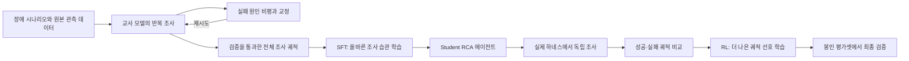
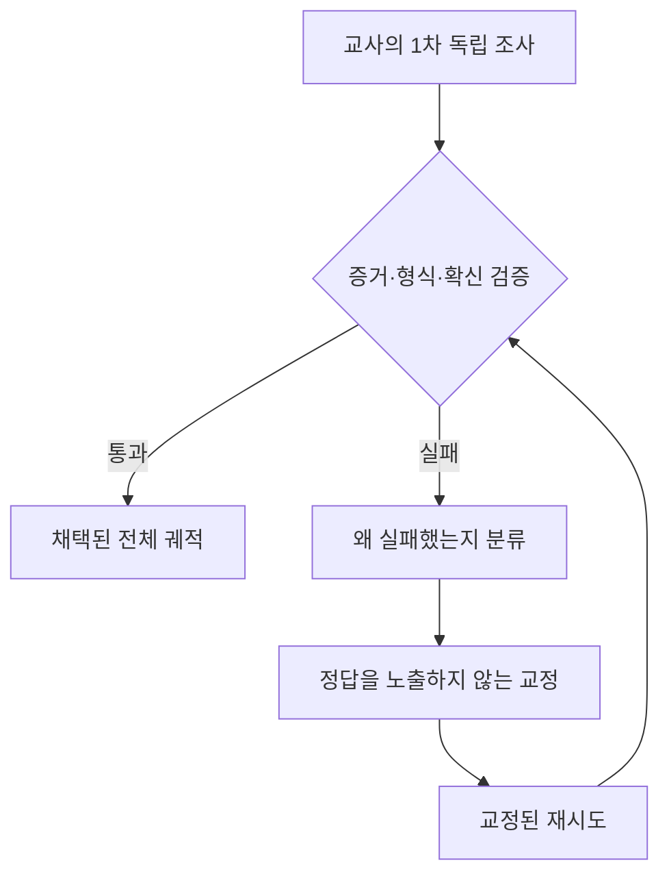

# RCA 모델 개발 현황과 학습 파이프라인

> 기준 시점: 2026-08-28 UTC  
> 이 문서는 서버·세션 운영법이나 코드 구조가 아니라, **어떤 RCA 모델을 왜 만들고 있으며 데이터·학습·평가가 어떻게 연결되는지**를 설명한다.

## 1. 한 문장 요약

현재 만드는 모델은 장애 보고서를 한 번에 찍어내는 분류기가 아니다. 실제 운영자처럼 여러 관측 도구를 선택해 조사하고, 원인 후보를 반증하며, **인용 가능한 증거와 발생 메커니즘이 갖춰졌을 때만 원인을 확정하는 RCA 에이전트**다.

전체 흐름은 다음과 같다.

핵심 원칙은 세 가지다.

1. **원본 데이터를 함부로 요약하거나 버리지 않는다.** 모델에게 한 번에 보여주는 양만 제한하고, 필요하면 원본 전체를 다시 조회할 수 있게 한다.
2. **생각은 자유롭게, 실행은 엄격하게 한다.** 모델의 가설 수립은 제한하지 않지만 존재하지 않는 metric, target, action을 실행하거나 출처 없는 원인을 확정할 수는 없다.
3. **정답보다 조사 과정 자체를 학습한다.** 어떤 도구를 왜 선택했고, 결과가 가설을 지지했는지 반박했는지, 실패 후 어떻게 방향을 바꿨는지를 전체 궤적으로 학습한다.

---

## 2. 우리가 풀려는 문제

일반 언어모델은 장애 설명을 그럴듯하게 만드는 데는 능하지만 RCA에는 다음 문제가 있다.

- 첫 번째 이상 징후를 곧바로 근본원인으로 착각한다.
- 존재하지 않는 metric이나 시스템 이름을 만들어 낸다.
- 최근 로그 몇 줄만 기억하고 앞에서 확인한 증거를 잃는다.
- 상관관계를 인과관계로 과장한다.
- “조사했다”는 사실만으로 원인을 `confirmed` 처리한다.
- 최종 답에 어떤 관측이 원인을 지지하거나 반박하는지 남기지 않는다.

### 대표 예시: HTTP 409는 원인이 아니다

재고 서비스에서 HTTP 409가 급증했다고 가정하자.

- 가설 A: 정상적인 품절 때문에 주문이 거절됐다.
- 가설 B: 재입고 배치가 중단되어 재고가 회복되지 않았다.
- 가설 C: 외부 창고 시스템과의 연동 실패로 RESTOCK 이벤트가 들어오지 않았다.

409 로그만 보면 세 가설을 구분할 수 없다. 따라서 좋은 RCA는 다음처럼 이어져야 한다.

1. 409 급증 시점을 확인한다.
2. 같은 시간대 재고 수량의 **전체 시계열**을 조회한다.
3. 정상적으로 들어와야 할 RESTOCK 이벤트가 실제로 유입됐는지 확인한다.
4. 배치 실행·실패 이벤트와 외부 연동 경계를 조사한다.
5. “RESTOCK 유입 중단 → 재고 고갈 지속 → 409 증가”의 시간·메커니즘 사슬이 성립하는지 확인한다.
6. 경쟁 가설인 정상 품절을 반박하는 증거도 함께 남긴다.

즉, “409가 보였다”는 관측이고, “재입고 배치 중단이 재고 고갈을 지속시켰다”가 검증 가능한 원인 주장이다.

---

## 3. Student 하네스의 개념

하네스는 모델을 대신해 추론하는 규칙 엔진이 아니다. 모델이 운영 환경을 안전하고 검증 가능하게 조사하도록 만드는 **실험실과 기록 장치**다.

### 3.1 모델은 자유롭게 생각한다

모델은 다음과 같은 가설을 자유롭게 세울 수 있다.

> 결제 서비스 자체의 CPU 문제일 수도 있지만, trace가 외부 PG 경계에서 끊긴다면 외부 의존성 장애일 가능성이 더 높다. 먼저 서비스 내부 오류와 외부 경계 실패를 비교하자.

이 사고 문장을 enum이나 정해진 시나리오로 제한하지 않는다. 새로운 장애 조합에도 대응하려면 가설 공간은 열어 둬야 한다.

### 3.2 실제 행동만 허용된 계약을 통과한다

모델이 실행하려는 도구 호출은 구조화된 형식이어야 한다. 예를 들면 다음과 같다.

| 항목 | 모델의 선택 예시 | 검증 내용 |
|---|---|---|
| 행동 | 특정 서비스의 metric 조회 | 현재 환경에서 지원되는 행동인가 |
| 대상 | `payment-service` | 실제 조사 가능한 대상인가 |
| metric | 해당 대상의 오류율 metric | 그 대상에서 실제 제공되는 metric인가 |
| 시간 범위 | 최초 장애 전후 10분 | 시작과 끝이 올바른가 |
| 조회 한도 | 12건 | 허용된 응답 크기를 넘지 않는가 |

존재하지 않는 `payment.magic_failure_rate`를 모델이 만들어 내면 실행 전에 거절한다. 반대로 새로운 metric이 실제 환경에 추가되면 registry에 반영되므로, 모델 코드를 고치지 않아도 선택 가능해진다.

### 3.3 Capability registry란 무엇인가

Capability registry는 단순한 고정 도구 목록이 아니다. **이번 장애 조사에서 실제로 사용할 수 있는 능력의 메뉴판**이다.

예를 들어 이번 사건에 다음 항목이 존재한다고 하자.

- 조사 대상: 주문 서비스, 결제 서비스, PostgreSQL, 외부 PG 경계
- 관측 종류: metric, log, trace, change event, DB blocking
- 결제 서비스에서 실제 제공되는 metric: 요청 수, 오류율, 지연시간
- PostgreSQL에서 실제 제공되는 metric: active session, lock wait, replica lag

그러면 모델은 결제 서비스에 `replica lag`를 요청할 수 없다. 그 metric은 PostgreSQL에만 등록되어 있기 때문이다. 이 구조는 모델의 자유를 줄이기 위한 것이 아니라 **환각된 행동으로 조사 턴을 낭비하지 않게 하는 현실 경계**다.

### 3.4 증거 지도와 typed ledger란 무엇인가

“증거 지도”는 차트와 로그를 요약해 버린 짧은 보고서가 아니다. 원본 관측과 조사 결과에 식별자를 붙여 연결하는 **증거 인덱스**다. 실제 영속 기록은 typed ledger에 쌓인다.

예를 들면 다음과 같다.

| 관측 ID | 조사 행동 | 얻은 사실 | 원본 보존 |
|---|---|---|---|
| `obs-001` | 결제 오류율 전체 시계열 조회 | 10:02부터 급증 | 전체 시계열 참조 보존 |
| `obs-002` | 배포 변경 조회 | 09:58 결제 서비스 배포 | 변경 이벤트 보존 |
| `obs-003` | trace 조회 | 외부 PG 호출 전 내부 처리는 정상 | trace 원문 보존 |
| `obs-004` | 외부 경계 이벤트 조회 | 10:01부터 timeout | 이벤트 원문 보존 |

최종 답은 단순히 “외부 PG 장애”라고 쓰지 않는다.

- 주장: 외부 PG 응답 지연이 결제 실패를 유발했다.
- 메커니즘: 외부 호출 timeout이 결제 요청 실패로 전파됐다.
- 지지 증거: `obs-003`, `obs-004`
- 반대 증거: `obs-002` — 배포가 있었지만 내부 trace 구간은 정상이다.
- 상태: 외부 원인은 직접 통제할 수 없으므로 증거 수준에 따라 provisional 또는 외부 의존성 원인으로 표현한다.

모든 관측을 typed ledger에 남기므로, 최근 문자열 6개만 기억하던 이전 방식처럼 초반의 결정적 증거가 사라지지 않는다. 실패한 도구 호출도 남겨서 모델이 같은 실수를 반복했는지 평가할 수 있다.

### 3.5 왜 원본 증거를 300개로 자르면 안 되는가

이전 구조에서는 하네스를 만들기 전에 증거를 300개로 잘라 뒤쪽 데이터에 영구적으로 접근할 수 없는 위험이 있었다. RCA에서는 드문 단일 이벤트 하나가 원인을 결정할 수 있으므로 치명적이다.

현재 원칙은 다음과 같다.

- 저장소에는 원본 증거를 전부 보존한다.
- 첫 화면에는 이상도가 높은 일부만 보여준다.
- 모델이 target, source, kind, time 조건으로 원본 저장소를 다시 조회한다.
- 한 번의 조회 결과만 제한한다. 원본 자체는 제거하지 않는다.
- metric 기반 인과 주장은 축약된 숫자 몇 개가 아니라, 보존된 전체 시계열을 참조해야 확정할 수 있다.

즉 “전부 보존”과 “매 턴 전부 프롬프트에 복사”는 다르다. 전자는 필수이고, 후자는 비용과 문맥 오염 때문에 구조 조회로 대체한다.

### 3.6 `confirmed`는 어떻게 결정되는가

모든 원인 유형에 같은 증명 규칙을 적용하지 않는다.

| 원인 유형 | 확정에 필요한 대표 증거 |
|---|---|
| DB blocking | 실제 blocking session 또는 lock chain |
| 변경 유발 | 변경 시점이 최초 장애보다 앞서고 영향 대상이 연결됨 |
| metric 인과 | 최초 장애 전후의 전체 시계열과 임계 초과 시점 |
| 자원 포화 | 전체 시계열에서 포화가 지속되고 영향과 연결됨 |
| 프로세스 사망 | OOM kill, TaskOOM, crash loop, restart 증가가 짧은 시간 안에 한 사슬로 관측됨 |
| 직접 이벤트 | 원인을 직접 나타내는 구조화 이벤트 |
| trace 경계 | 실패가 시작되는 정확한 호출 경계의 trace |
| 외부 의존성 | 내부 대상과 외부 경계 실패를 연결하는 증거 |

예를 들어 CPU가 높다는 한 점만으로 자원 포화를 확정할 수 없다. 전체 시계열이 보존되어야 하고, 장애 시점과 맞아야 한다. OOM도 로그 한 줄만으로 확정하지 않고 프로세스 kill부터 재시작까지의 연속 사슬을 요구한다.

증명이 부족하면 모델은 실패한 것이 아니라 정직하게 `provisional` 또는 `insufficient`를 선택해야 한다. 확신을 낮추는 능력도 RCA 성능의 일부다.

---

## 4. 교사 데이터 생성: 한 번의 정답이 아니라 반복 조사

교사 데이터는 정답 문장 하나를 생성하는 방식이 아니다. ThinkFL/RLM 계열 아이디어를 반영해 다음과 같은 재귀적 조사 구조를 만든다.

교정은 정답을 알려주는 힌트가 아니다. 부족한 조사 방향을 알려주는 피드백이다.

### 실제 교정 예시

1차 시도:

> HTTP 409가 급증했으므로 재고 서비스 품절이 원인이다.

비평:

> 409는 정상 품절과 재입고 중단을 구분하지 못한다. 현재 증거만으로 원인을 확정할 수 없다.

교정:

> 장애 전후 재고 전체 시계열과 RESTOCK 유입 여부를 조회하고, 정상 품절 가설과 배치 중단 가설을 비교하라.

재시도:

> 재고는 09:55부터 감소했고, 평소 10:00에 들어오던 RESTOCK 이벤트가 없었다. 같은 시각 배치 실패 이벤트가 확인됐다. 409는 결과이고, 재입고 배치 중단이 원인 후보로 지지된다.

이때 데이터에는 다음이 서로 구분되어 남는다.

- 실패한 1차 조사
- 실패 이유
- 정답을 직접 노출하지 않는 교정
- 교정 후 재시도
- 검증기가 채택한 최종 조사

다만 **SFT에는 검증을 통과한 최종 전체 궤적만 넣는다.** 실패·교정·재시도 관계는 recursive training과 성공/실패 선호쌍 구성에 활용한다. 실패한 추론을 정답처럼 SFT에 섞지 않는다.

기존 Claude 교사가 만든 유효 궤적도 버리지 않고 포함하며, 신규 교사 생성은 Codex 기준으로 이어간다. 교사 이름보다 중요한 기준은 동일한 하네스와 scorer를 통과했는지다.

### 데이터 누수 방지

36개 시나리오는 장애 가족 단위로 나뉜다.

| 구분 | 수량 | 용도 |
|---|---:|---|
| 학습 후보 | 23 | 교사 조사와 학습 데이터 생성 가능 |
| 봉인 평가 | 12 | 학습·교정·프롬프트 설계에서 완전히 격리 |
| 제외 | 1 | 현재 계약에서 사용하지 않음 |

같은 근본원인을 조금 변형한 시나리오가 학습과 평가에 동시에 들어가면 모델이 원리를 배운 것인지 사건을 외운 것인지 구분할 수 없다. 그래서 개별 case가 아니라 **장애 family 단위**로 격리한다.

현재 학습 후보 23건 중 SFT에 채택된 범위는 20개 시나리오, 24개 전체 궤적이다. 남은 3건은 불완전한 상태로 따로 보류되어 있으며, 완성된 교사 데이터처럼 조용히 섞지 않았다.

---

## 5. SFT: 올바른 조사 습관을 먼저 학습

SFT의 목적은 모델에게 특정 사건의 정답을 암기시키는 것이 아니다. 다음 행동 패턴을 기본 습관으로 만드는 것이다.

- 최초 증상과 근본원인을 구분한다.
- 가능한 원인 후보를 좁히는 도구를 선택한다.
- tool 결과가 실패하면 다른 경로로 복구한다.
- metric 이름을 추측하지 않고 실제 가능한 metric을 확인한다.
- 시계열, 로그, trace, change, DB 상태를 시간축으로 연결한다.
- 지지 증거뿐 아니라 경쟁 가설을 약화시키는 증거를 찾는다.
- 근거가 부족하면 provisional로 멈춘다.
- 최종 답에 원인, 메커니즘, 지지·반대 증거를 명시한다.

### 각 턴을 독립 샘플로 쪼개지 않는다

현재 SFT 샘플 하나는 **한 사건의 전체 multi-turn 조사 episode**다.

예를 들어 다음 6개 턴은 여섯 개의 무관한 샘플이 아니다.

1. 오류율 증가 확인
2. 배포 변경 확인
3. 내부 trace 정상 확인
4. 외부 경계 timeout 확인
5. 배포 가설 반박
6. 외부 의존성 원인 정리

앞선 관측이 다음 도구 선택의 이유가 되므로 통째로 학습한다. 모델이 생성한 assistant 응답에만 loss를 적용하지만, 사용자 입력·도구 호출·도구 관측은 문맥으로 그대로 보존된다. 현재 SFT 데이터는 다음 특성을 가진다.

- 20개 시나리오
- 24개 채택 궤적
- 총 264턴
- 27개의 실패 관측도 문맥에 보존
- case 수가 많은 장애가 학습을 독점하지 않도록 case 균형 적용
- base model 전체가 아니라 LoRA adapter를 학습

SFT 단계는 완료됐다. 현재 Student의 기본 모델은 이 SFT 결과다.

---

## 6. RL: SFT 모델 위에서 더 나은 전체 조사를 선호하게 만들기

RL은 바닐라 모델에서 다시 시작하지 않는다. **SFT 모델 위에 LoRA adapter를 추가 학습**한다.

초기 RL 실험에서는 평균 보상이 SFT보다 내려가는 퇴행이 있었다. 단순히 실패 답변을 밀어내는 학습은 이미 잘하던 조사 행동까지 망가뜨릴 수 있기 때문이다. 현재 방식은 전체 궤적 선호학습과 성공 궤적 모방 앵커를 함께 사용한다.

### 선호쌍 예시

같은 장애에 두 조사 궤적이 있다고 하자.

**선호 궤적**

> 오류율 확인 → 전체 latency 시계열 확인 → trace로 DB 경계 특정 → blocking session 확인 → lock holder와 영향 메커니즘 제시 → 증거 ID와 함께 confirmed

**비선호 궤적**

> 오류율 확인 → 일반 로그 grep 반복 → DB가 느려 보인다고 추측 → 증거 ID 없이 confirmed

RL은 마지막 답 한 줄만 비교하지 않는다. 어떤 도구를 어떤 순서로 선택했고, 관측을 어떻게 다음 판단에 사용했는지를 포함한 **전체 조사 궤적**을 비교한다.

현재 v6의 학습 목적은 다음 두 항을 결합한다.

1. 선호 궤적의 상대 확률을 비선호 궤적보다 높인다.
2. 선호 궤적 자체의 생성 능력이 무너지지 않도록 작은 imitation/NLL 앵커를 둔다.

이 방식은 SFT가 만든 좋은 기본 정책을 보존하면서, 실패 궤적과의 경계를 더 선명하게 만들려는 것이다. 현재 20개 시나리오에서 만든 20개 전체 궤적 쌍으로 v6 학습 중이며, 기준 시점에는 9/20 step까지 진행됐다.

모델은 계속 adapter 형태로 관리한다. 추론 서버 호환이나 최종 배포가 필요할 때만 base와 병합하며, 학습 중간마다 거대한 merged model을 복제하지 않는다.

---

## 7. 평가: 정답 적중뿐 아니라 증명 품질까지 본다

평가 점수와 RL 학습용 성공·실패 궤적 판정은 같은 채점 계약을 기준으로 한다. 학습용 궤적을 고를 때는 한 기준을 쓰고 평가할 때는 다른 기준으로 판단하는 불일치를 줄이기 위해서다.

### 채점 항목

| 항목 | 질문 | 현재 가중치 |
|---|---|---:|
| 원인 정확도 | 올바른 내부 대상 또는 외부 원인을 찾았는가 | 45% |
| 증명 충족 | 원인 유형에 맞는 결정적 증거가 있는가 | 25% |
| 확신 보정 | confirmed/provisional/insufficient를 맞게 선택했는가 | 15% |
| 효율 | 불필요한 턴을 줄였는가 | 10% |
| 도구 성공률 | 유효한 조사를 수행했는가 | 5% |

근거 없이 `confirmed`하거나, 축약된 metric만 보고 인과를 확정하면 큰 penalty를 받는다. 따라서 빨리 답하는 것보다 정확하게 조사하고 정직한 확신 수준을 내는 것이 우선이다.

### 공정 비교 조건

바닐라, SFT, RL 모델 비교에서는 다음 조건을 모두 같게 유지해야 한다.

- 같은 Student 하네스와 도구
- 같은 원본 데이터 복원 방식
- 같은 시나리오와 반복 횟수
- 같은 generation 설정
- 같은 scorer
- 같은 actor 실행물
- 각 모델 artifact의 고유 fingerprint 기록

이 정보가 빠진 과거 결과는 참고용 진단일 뿐 최종 순위의 증거로 인정하지 않는다.

### 2단계 평가

1. **학습셋 모니터 평가**: 대표 6개 학습 case를 각 3회 실행해 모델이 기본 조사 능력을 유지하는지 빠르게 본다.
2. **봉인 평가**: 학습에 전혀 노출되지 않은 12개 case를 각 3회 실행한다. 최종 성능 주장은 이 결과로만 한다.

최종 통과 조건은 단순 평균 보상 하나가 아니다. RL이 SFT보다, SFT가 바닐라보다 다음 항목에서 퇴행하지 않아야 한다.

- 다수결 strict 정답 수
- 전체 strict 정답 실행 수
- 평균 reward
- 평균 root-cause F1
- 증거 계약 완성도
- 형식 오류 0
- 근거 없는 confirmed 0

---

## 8. 현재 진행 상황

| 단계 | 상태 | 의미 |
|---|---|---|
| Student 하네스 핵심 계약 | 완료 | 원본 증거 보존, 구조 조회, capability registry, typed ledger, 증거 참조, 원인별 증명, 통합 scorer 구현 |
| 데이터 family 분리 | 완료 | 23 train / 12 sealed eval / 1 excluded |
| 교사 데이터 정제 | 1차 완료 | 20개 시나리오, 24개 채택 전체 궤적. 불완전 3건은 보류 |
| SFT | 완료 | 전체 episode 단위 LoRA 학습 완료 |
| SFT 공정 모니터 평가 | 미완료 | 6개 중 3개 case 완료 후 현재 실행이 멈춘 상태. 재개 및 결과 해석 필요 |
| 초기 RL v1~v5 | 실험 완료 | 일부 실험에서 SFT 대비 퇴행 확인. 최종 후보로 확정하지 않음 |
| 개선 RL v6 | 진행 중 | 전체 궤적 RPO 방식, 현재 9/20 step |
| 최종 봉인 평가 | 미실행 | v6 완료 후 바닐라 → SFT → RL을 동일 조건으로 평가해야 함 |

따라서 현재 단계에서 “RL 모델이 가장 좋다”라고 말할 수는 없다. 역사적 결과에서는 SFT가 바닐라보다 좋아졌지만 초기 RL들이 SFT보다 낮아진 적이 있다. 다만 과거 결과는 현재의 엄격한 provenance와 증거 계약이 완성되기 전 결과라 최종 순위로 사용하지 않는다.

---

## 9. 지금 모델이 배우고 있는 RCA 방식

완성하려는 동작을 하나의 예로 정리하면 다음과 같다.

### 사건

주문 성공률이 10:02부터 급락했다.

### 나쁜 조사

1. 주문 서비스 error log에서 timeout 발견
2. “주문 서비스 timeout이 원인”이라고 확정

문제: timeout은 증상일 수 있고, 어느 경계에서 시작됐는지 모른다.

### 목표 조사

1. 전체 후보와 가능한 관측 종류를 확인한다.
2. 오류 시작 시간을 확정한다.
3. 주문 서비스의 오류율·지연시간 전체 시계열을 확인한다.
4. trace로 실패가 주문 내부, 결제 호출, DB 호출 중 어디서 시작됐는지 찾는다.
5. DB 경계라면 blocking·top SQL·replica lag를 조사한다.
6. 결제 경계라면 결제 내부와 외부 PG trace를 나눠 본다.
7. 같은 시각의 배포·설정 변경을 확인하되, 시간상 앞선다는 이유만으로 원인 처리하지 않는다.
8. 경쟁 가설을 반박한다.
9. 증거가 원인 유형의 증명 규칙을 충족하면 confirmed, 아니면 provisional로 답한다.

### 목표 출력

> **상태:** confirmed  
> **원인:** PostgreSQL의 blocking transaction  
> **메커니즘:** 장기 transaction이 주문 쓰기 lock을 점유했고, 대기 세션 증가가 주문 timeout으로 전파됐다.  
> **지지 증거:** 오류 시작 전 생성된 lock holder, 장애 구간의 blocking chain, 같은 시간의 주문 DB span 지연  
> **반대 증거:** 주문 서비스 배포는 없었고 CPU·메모리는 정상 범위  
> **권고:** lock holder 종료 및 해당 transaction 경로 수정

핵심은 정답 이름 하나가 아니라, **관측 → 가설 → 검증 → 반증 → 확신 보정 → 증거가 붙은 결론**의 전체 과정이다.

---

## 10. 남은 작업과 완료 기준

### 바로 남은 작업

1. 진행 중인 RL v6 학습을 완료하고 adapter와 실행 manifest를 고정한다.
2. 멈춘 SFT 학습셋 모니터 평가를 안전하게 재개한다.
3. v6 RL 모델도 동일한 6-case 모니터를 실행한다.
4. 행동 분포를 비교해 신규 metric/action을 실제로 활용하는지, grep 반복이나 조기 정체가 남았는지 분석한다.
5. 통과 후보에 대해 바닐라·SFT·RL의 12-case × 3회 봉인 평가를 수행한다.
6. RL이 SFT보다 퇴행하면 선호쌍 구성, 강도, imitation 앵커를 조정해 다시 학습한다.
7. 보류한 교사 case 3건은 증거 결함과 추론 실패를 구분해 별도 완성한다.

### 프로젝트 완료라고 부를 수 있는 조건

- 봉인 평가에서 SFT가 바닐라 대비 유의미하게 개선된다.
- RL이 SFT의 strict accuracy, reward, root F1, evidence coverage를 떨어뜨리지 않는다.
- 형식 오류와 허위 action/metric 사용이 없다.
- 근거 없는 confirmed가 없다.
- 모든 실험이 어떤 데이터, base model, adapter, 하네스, scorer로 수행됐는지 재현 가능하다.
- 새로운 장애 family에서도 특정 키워드 암기가 아니라 조사 원칙이 전이된다.

현재는 **SFT 모델과 핵심 하네스는 만들어졌고, 개선 RL 및 공정 평가를 진행하는 단계**다. 최종 모델 확정 단계는 아니다.

---

## 11. 용어 요약

| 용어 | 뜻 |
|---|---|
| Student | 실제 RCA를 수행하도록 학습되는 오픈 모델 |
| Teacher | 좋은 조사 궤적을 생성하고 실패를 교정하는 상위 모델 |
| 하네스 | Student가 도구를 쓰고 증거를 남기며 평가받는 실행 환경 |
| Capability registry | 현재 사건에서 실제 가능한 target·metric·action 목록 |
| 증거 지도 | 원본 증거와 조사 관측을 ID로 연결한 인덱스 |
| Typed ledger | 모든 성공·실패 관측을 구조화해 영속 보관하는 기록부 |
| support refs | 원인 주장을 직접 지지하는 관측 ID |
| counter refs | 경쟁 가설을 반박하거나 주장의 한계를 보여주는 관측 ID |
| SFT | 검증된 좋은 전체 조사 궤적을 모방하는 1차 학습 |
| RL/RPO | 같은 사건의 좋은 궤적을 나쁜 궤적보다 선호하도록 하는 후속 학습 |
| LoRA | base model 전체를 복제하지 않고 작은 adapter만 학습하는 방식 |
| sealed evaluation | 데이터 생성과 설계 과정에서 보지 않은 봉인 시나리오 평가 |
| confirmed | 원인 유형별 결정적 증명 규칙까지 충족한 상태 |
| provisional | 유력하지만 결정적 증거가 부족하거나 외부 경계 때문에 확정할 수 없는 상태 |
